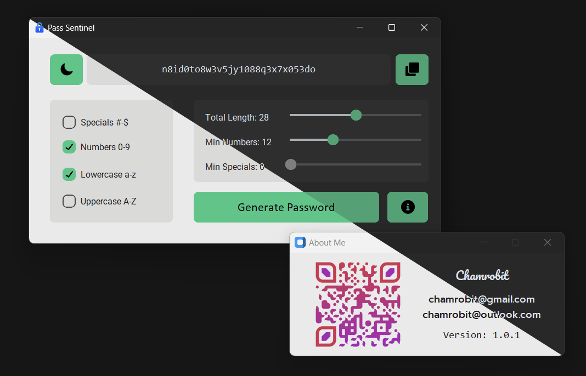

# Pass Sentinel - Modern Password Generator App

## Overview

Pass Sentinel is a modern and user-friendly password generator application built using Python and the CustomTkinter library. This application allows you to easily generate strong and secure passwords based on your preferences, including character types, length, and more. Pass Sentinel features both dark and light themes to suit your visual preferences.

## Features

- **Password Generation**: Quickly generate random passwords.
- **Customization**: Choose the length and character types (specials, numbers, lowercase, uppercase) for your password.
- **Visual Themes**: Switch between a modern dark and light theme for a comfortable user experience.

## Usage

1. Clone this repository to your local machine.
2. Ensure you have Python and the required libraries installed.
3. Run the `pass_sentinel.py` file to start the Pass Sentinel app.
4. Use the app's intuitive interface to generate strong passwords.

## Screenshots

## About the Developer

- **Name**: Chamrobit
- **Email**: chamrobit@gmail.com, chamrobit@outlook.com
- **Version**: 1.0.1